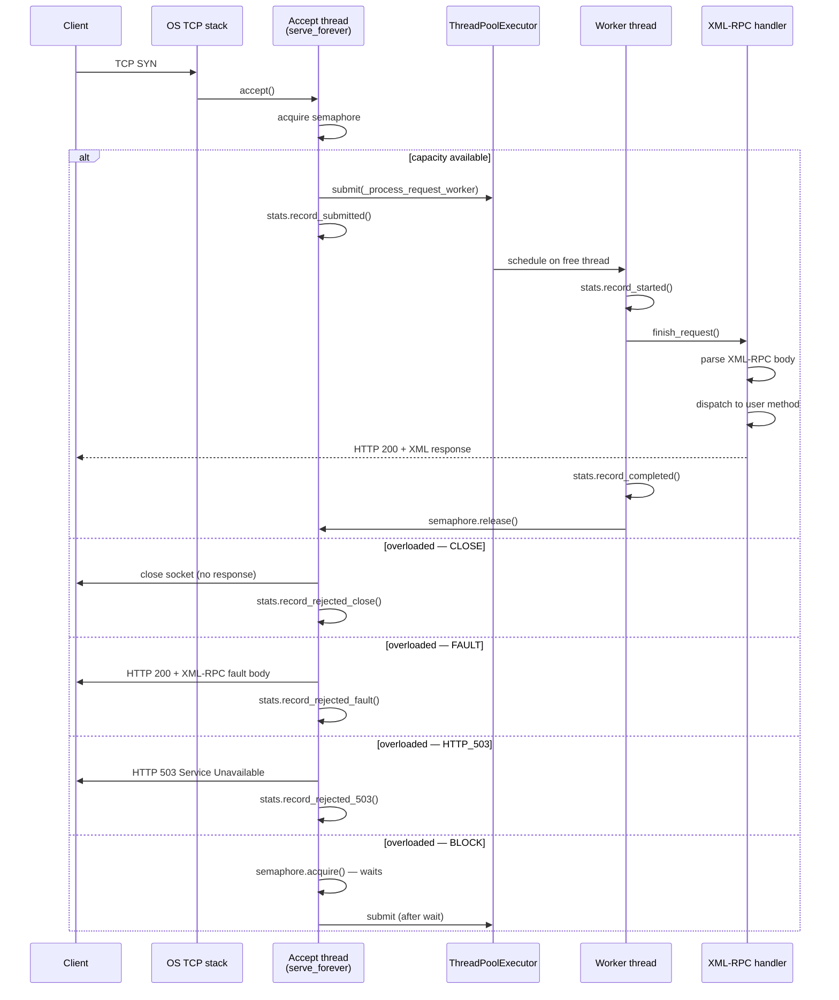
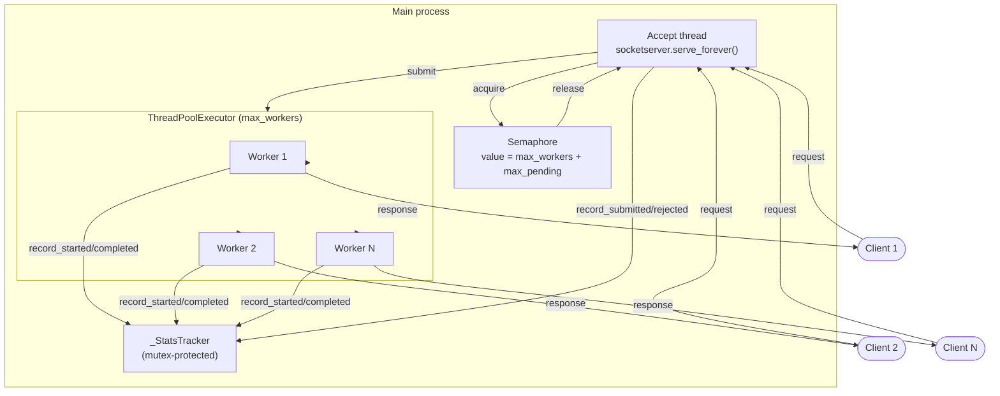
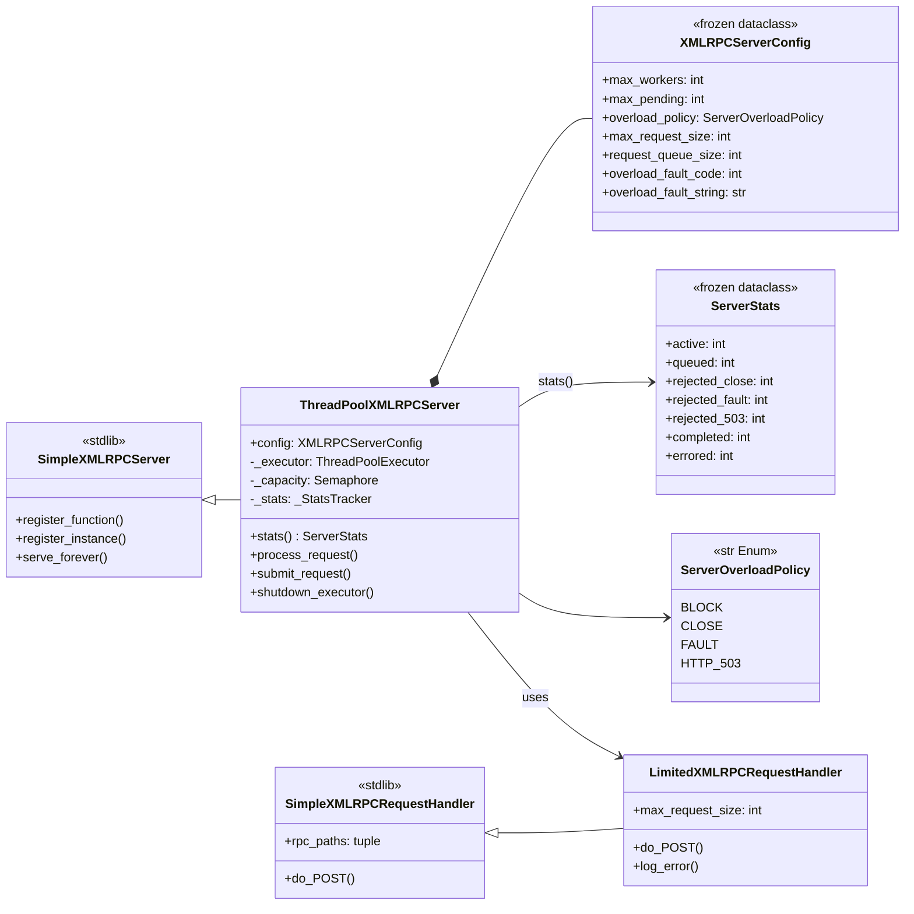
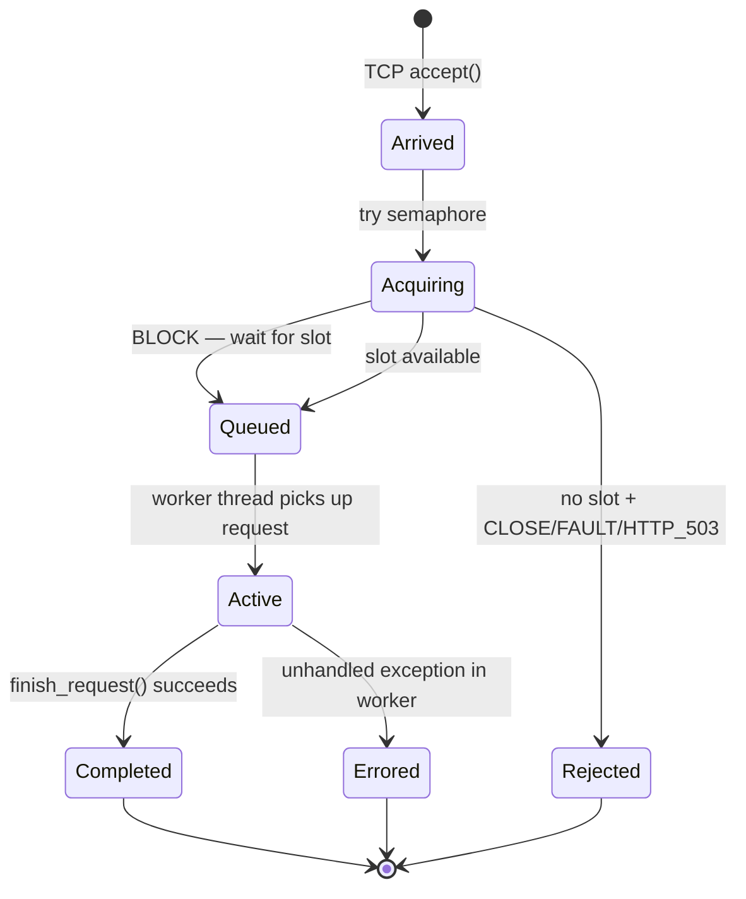
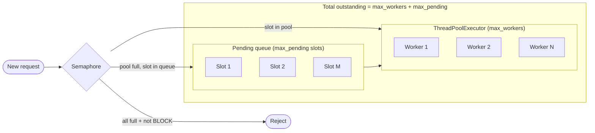
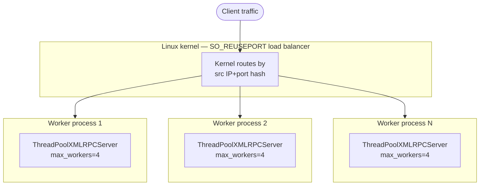

# Architecture

This page describes the internal design of `ThreadPoolXMLRPCServer` using
diagrams rendered from Mermaid source.

---

## Request lifecycle

The sequence from the moment a TCP connection arrives to the moment a response
is sent:

---

## Threading model

---

## Class hierarchy

---

## Request state machine

Each request passes through the following states inside the server:

---

## Capacity model

---

## Multi-process scale-out (SO_REUSEPORT)

---

## Design decisions

### Why a semaphore instead of a queue?

A `threading.Semaphore` is chosen over a `queue.Queue` because:

1. **Two-level limiting**: The semaphore guards both the worker pool *and* the
   pending queue in one atomic operation — no separate pending-count variable
   needed.
2. **No data movement**: The semaphore slot is acquired before the socket is
   handed to the executor, so the socket never sits in a Python queue consuming
   file-descriptor budget.
3. **BLOCK for free**: When `overload_policy=BLOCK`, `semaphore.acquire()` with
   no timeout blocks the accept thread naturally, backpressuring the OS TCP
   stack at the application layer.

### Why `ThreadPoolExecutor` over `ThreadingMixIn`?

`ThreadingMixIn` spawns one thread per request — unbounded and impossible to
limit. `ThreadPoolExecutor` reuses threads and has a fixed upper bound, giving
predictable memory footprint under load.

### Why inherit from `SimpleXMLRPCServer`?

Constructor-level compatibility with `SimpleXMLRPCServer` means drop-in
replacement: existing code that passes `logRequests`, `allow_none`, etc. works
unchanged. The handler chain and method dispatch are unchanged from the stdlib.
