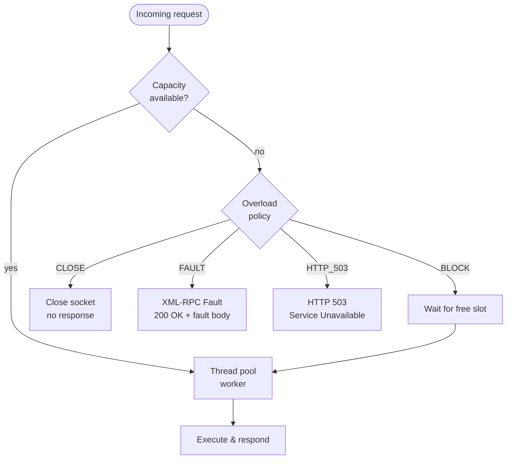

# Overload Policies

When every worker slot and every queue slot is taken, `ThreadPoolXMLRPCServer`
must decide what to do with the next incoming request. The **overload policy**
controls this behaviour.

---

## Capacity model

```
total outstanding capacity = max_workers + max_pending
```

| Parameter | Role |
|-----------|------|
| `max_workers` | Maximum requests executing concurrently in the thread pool |
| `max_pending` | Maximum requests waiting for a free worker slot |
| `request_queue_size` | OS-level TCP accept backlog (kernel-side, before the application sees the connection) |

`max_pending=None` (the default) resolves to `max_workers`, so the default
total capacity is `2 × max_workers`.

For **latency-sensitive** deployments set `max_pending=0` — any request that
cannot be picked up immediately is rejected rather than queued.

---

## Policies

### `BLOCK` (default)

```python
server = ThreadPoolXMLRPCServer(
    ("127.0.0.1", 8000),
    max_workers=4,
    overload_policy=ServerOverloadPolicy.BLOCK,
)
```

The **accept thread blocks** until a worker slot opens, then hands off the
request. No request is ever actively rejected — excess connections queue at the
OS TCP backlog level (`request_queue_size`).

**Use when:** load is trusted, bounded, and low-variance (e.g. internal RPC
between two services at known call rates).

**Risk:** unbounded latency under burst; a stuck worker can cause cascading
queueing.

---

### `CLOSE`

```python
server = ThreadPoolXMLRPCServer(
    ("127.0.0.1", 8000),
    max_workers=4,
    overload_policy=ServerOverloadPolicy.CLOSE,
)
```

The connection socket is closed **immediately** with no response. The client
receives a connection-reset error.

**Use when:** behind a load balancer or service mesh that can retry on another
instance; fast load shedding is more important than a useful error message.

**Risk:** clients without retry logic see opaque connection failures.

---

### `FAULT`

```python
server = ThreadPoolXMLRPCServer(
    ("127.0.0.1", 8000),
    max_workers=4,
    overload_policy=ServerOverloadPolicy.FAULT,
    overload_fault_code=-32500,
    overload_fault_string="Server overloaded — try again shortly",
)
```

An **XML-RPC fault response** is sent back to the client. This is transparent
to any XML-RPC-aware caller: `xmlrpc.client.ServerProxy` will raise
`xmlrpc.client.Fault` with the configured code and string.

**Use when:** callers speak XML-RPC and need to distinguish overload from
application-level errors; allows graceful degradation and client-side retries.

---

### `HTTP_503`

```python
server = ThreadPoolXMLRPCServer(
    ("127.0.0.1", 8000),
    max_workers=4,
    overload_policy=ServerOverloadPolicy.HTTP_503,
)
```

An **HTTP `503 Service Unavailable`** response is returned with a
`Retry-After: 1` header. Non-XML-RPC HTTP clients (health-checkers, API
gateways, browsers) can detect and act on this at the transport layer.

**Use when:** mixed XML-RPC/HTTP traffic; load balancer health probes; you
want visibility in standard HTTP tooling.

---

## Policy comparison



| Policy | Response | Client sees | Retryable? |
|--------|----------|-------------|------------|
| `BLOCK` | Delayed normal response | Nothing unusual | N/A |
| `CLOSE` | No response | `ConnectionResetError` | Yes (if idempotent) |
| `FAULT` | XML-RPC fault | `xmlrpc.client.Fault` | Yes (if idempotent) |
| `HTTP_503` | HTTP 503 | HTTP 503 status | Yes |

---

## Recommended defaults by deployment

| Deployment | Suggested settings |
|------------|---------------------|
| Embedded internal tool | `max_workers=4`, `max_pending=None`, `BLOCK` |
| Service with latency SLA | `max_workers=N`, `max_pending=0`, `FAULT` or `HTTP_503` |
| Behind a load balancer | `max_workers=N`, `max_pending=small`, `CLOSE` or `HTTP_503` |

---

## String form

Policies can also be passed as strings for configuration-file friendly usage:

```python
import os
from xmlrpc_extended import ServerOverloadPolicy, ThreadPoolXMLRPCServer

policy = os.environ.get("RPC_OVERLOAD_POLICY", "http_503")
server = ThreadPoolXMLRPCServer(("0.0.0.0", 8000), overload_policy=policy)
```

Valid string values: `"block"`, `"close"`, `"fault"`, `"http_503"`.
