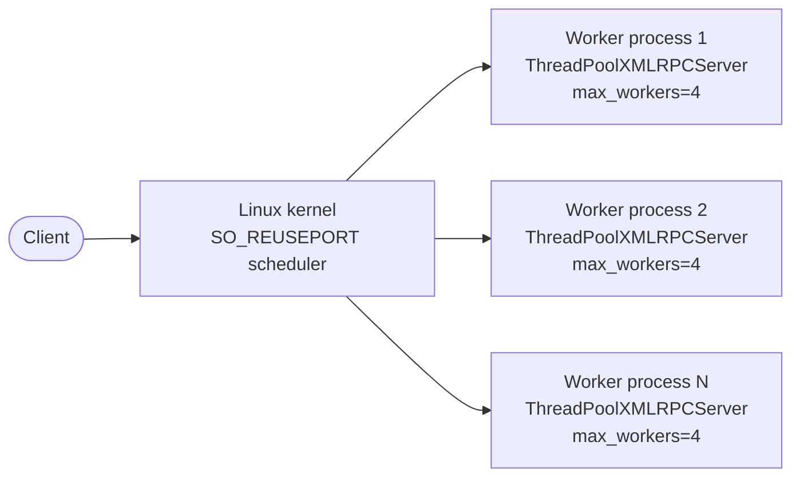

# Scale-out with SO_REUSEPORT

!!! warning "Linux only"
    `SO_REUSEPORT` requires **Linux kernel 3.9+**. This feature is not
    available on macOS or Windows. The `xmlrpc_extended.multiprocess` module
    raises `OSError` on non-Linux platforms.

---

## Background

Python's `ThreadPoolXMLRPCServer` scales *vertically* — more workers within a
single process. For horizontal scale-out across CPU cores or machines you need
multiple processes.

On Linux, `SO_REUSEPORT` lets multiple processes bind to the same IP:port. The
kernel distributes incoming connections across all listening sockets using a
hash of the source IP+port, giving approximately even load distribution **with
no userspace load balancer needed**.



---

## Quick start

### Option A — `spawn_workers` helper (recommended)

```python title="scale_out.py"
from xmlrpc_extended import ServerOverloadPolicy, ThreadPoolXMLRPCServer
from xmlrpc_extended.multiprocess import create_reuseport_socket, spawn_workers


def add(a: int, b: int) -> int:
    return a + b


def run_worker() -> None:
    sock = create_reuseport_socket("0.0.0.0", 8000)
    server = ThreadPoolXMLRPCServer(
        ("0.0.0.0", 8000),
        max_workers=4,
        overload_policy=ServerOverloadPolicy.FAULT,
        bind_and_activate=False,
        logRequests=False,
    )
    server.socket = sock
    server.server_bind = lambda: None   # socket already bound
    server.server_activate()
    server.register_function(add, "add")
    server.serve_forever()


if __name__ == "__main__":
    import os
    num_workers = os.cpu_count() or 4
    print(f"Spawning {num_workers} workers on :8000")
    spawn_workers(run_worker, num_workers=num_workers)
```

```console
python scale_out.py
# Spawning 8 workers on :8000
```

### Option B — manual `create_reuseport_socket`

Use this when you need full control over process lifecycle, signal handling, or
want to integrate with a process supervisor (systemd, supervisord):

```python title="worker.py"
from xmlrpc_extended import ThreadPoolXMLRPCServer
from xmlrpc_extended.multiprocess import create_reuseport_socket

sock = create_reuseport_socket("0.0.0.0", 8000)
server = ThreadPoolXMLRPCServer(
    ("0.0.0.0", 8000),
    max_workers=4,
    bind_and_activate=False,
)
server.socket = sock
server.server_bind = lambda: None
server.server_activate()
server.register_function(lambda a, b: a + b, "add")
server.serve_forever()
```

Then launch N copies:

```console
python worker.py &
python worker.py &
python worker.py &
wait
```

---

## Shared state and sessions

!!! danger "No shared mutable state between workers"
    Each worker process is a separate address space. In-process state (caches,
    connection pools, counters) is **not shared** between workers. If you need
    shared state use an external store (Redis, PostgreSQL, memcached).

    `server.stats()` returns per-process counters only. Aggregate across
    processes via a sidecar or by exposing stats as an RPC method and
    collecting from all workers.

- All workers **must register identical methods** — the kernel routes any
  connection to any worker.
- There are no sticky sessions. Do not use `SO_REUSEPORT` if your protocol
  requires session affinity.

---

## Performance characteristics

With `SO_REUSEPORT` the effective peak throughput is approximately:

```
peak_rps ≈ num_workers × (max_workers / mean_request_duration_s)
```

For example, 4 processes each with `max_workers=4` handling 20 ms requests:

```
peak_rps ≈ 4 × (4 / 0.020) = 800 rps
```

See the [Benchmarks](../benchmarks.md) page for measured numbers.
